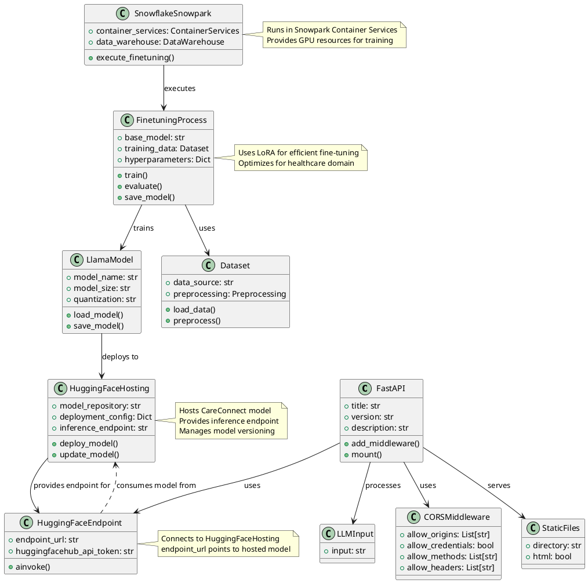

# CareConnect Architecture Documentation

## System Architecture

### Class Diagram


### Data Flow Diagram
```plantuml
@startuml CareConnect Dataflow

!define RECTANGLE class

' Data Sources and Storage
RECTANGLE "Snowflake\nCARECONNECT_TRAINING_DATA_STAGE" as SnowflakeStage {
    + training_data: Table
    + validation_data: Table
    + metadata: JSON
}

' Processing Components
RECTANGLE "Snowflake Snowpark\nContainer Services" as SnowparkContainer {
    RECTANGLE "ML Runtime 1.0" as MLRuntime {
        RECTANGLE "Data Loader" as DataLoader
        RECTANGLE "Preprocessing" as Preprocessing
        RECTANGLE "Training Pipeline" as TrainingPipeline
        RECTANGLE "Model Checkpointing" as Checkpointing
    }
}

' Model Storage and Deployment
RECTANGLE "Model Artifacts" as ModelArtifacts {
    + model_weights: safetensors
    + config: JSON
    + tokenizer: files
}

RECTANGLE "HuggingFace\nModel Repository" as HuggingFaceRepo {
    + model_files: files
    + inference_endpoint: URL
}

' Application Components
RECTANGLE "FastAPI\nApplication" as FastAPI {
    RECTANGLE "HuggingFaceEndpoint" as HFEndpoint
    RECTANGLE "API Endpoints" as APIEndpoints
}

' External Systems
RECTANGLE "Client Applications" as Clients

' Data Flow
SnowflakeStage --> DataLoader : "1. Load training data"
DataLoader --> Preprocessing : "2. Raw data"
Preprocessing --> TrainingPipeline : "3. Processed data"
TrainingPipeline --> Checkpointing : "4. Model checkpoints"
Checkpointing --> ModelArtifacts : "5. Save artifacts"
ModelArtifacts --> HuggingFaceRepo : "6. Deploy model"
HuggingFaceRepo --> HFEndpoint : "7. Connect to endpoint"
HFEndpoint --> APIEndpoints : "8. Serve requests"
APIEndpoints --> Clients : "9. API responses"

' Notes
note right of SnowflakeStage
  Contains:
  - Training conversations
  - Medical knowledge base
  - Healthcare guidelines
end note

note right of MLRuntime
  GPU-accelerated training
  LoRA fine-tuning
  Gradient checkpointing
end note

note right of ModelArtifacts
  Includes:
  - Fine-tuned weights
  - Model configuration
  - Tokenizer files
  - Training metadata
end note

note right of HuggingFaceRepo
  Hosts:
  - Model repository
  - Inference endpoint
  - Model versioning
end note

@enduml
```

## How to Use These Diagrams

These diagrams are written in PlantUML format. To view them, you can:

1. Use the [PlantUML Online Editor](https://www.plantuml.com/plantuml/uml/)
2. Install a PlantUML plugin in your IDE (VS Code, IntelliJ, etc.)
3. Use a tool like [Mermaid](https://mermaid.live/) (though you'll need to convert the syntax)

## Diagram Updates

When making changes to the system architecture, please update these diagrams to maintain accurate documentation. The diagrams should reflect:

1. New components added to the system
2. Changes in relationships between components
3. Updates to data flow patterns
4. New deployment or infrastructure changes 