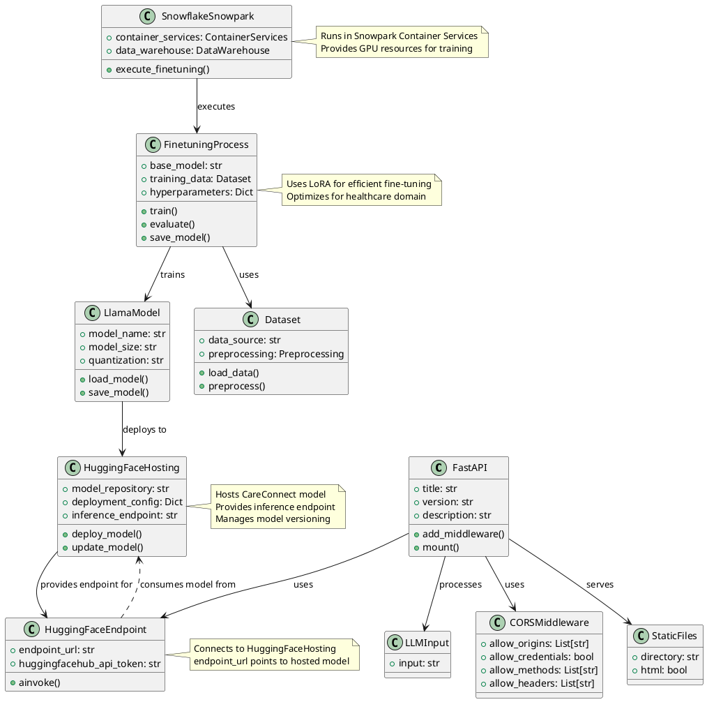

# CareConnect Class Diagram

## Component Descriptions

### Application Components
- **FastAPI**: Main application server handling HTTP requests
- **HuggingFaceEndpoint**: Interface to HuggingFace LLM services
- **LLMInput**: Data model for LLM input validation
- **CORSMiddleware**: Handles cross-origin resource sharing
- **StaticFiles**: Serves static web content

### Finetuning Components
- **SnowflakeSnowpark**: Container services for model training
- **FinetuningProcess**: Manages the model training workflow
- **LlamaModel**: Represents the base model being fine-tuned
- **Dataset**: Handles data loading and preprocessing

### Deployment Components
- **HuggingFaceHosting**: Manages model deployment and hosting 