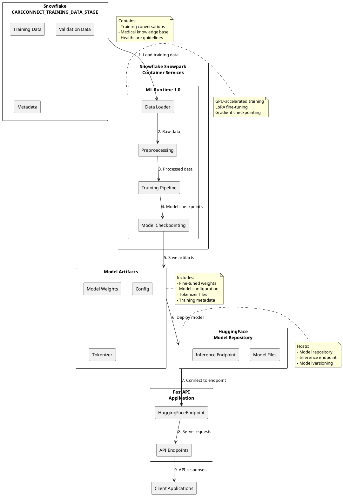

# CareConnect Data Flow Diagram

## Data Flow Description

### Training Data Flow
1. **Data Loading**: Training data is loaded from Snowflake CARECONNECT_TRAINING_DATA_STAGE
2. **Preprocessing**: Raw data is preprocessed in the ML Runtime
3. **Training**: Processed data is used to train the model
4. **Checkpointing**: Model checkpoints are saved during training
5. **Artifact Creation**: Final model artifacts are created

### Deployment Flow
6. **Model Deployment**: Model artifacts are deployed to HuggingFace
7. **Endpoint Connection**: FastAPI connects to the HuggingFace endpoint
8. **Request Serving**: API endpoints serve client requests
9. **Response Delivery**: Responses are delivered to client applications

### Key Components
- **Snowflake Stage**: Primary data storage
- **ML Runtime**: Training environment
- **Model Artifacts**: Trained model files
- **HuggingFace Repository**: Model hosting
- **FastAPI Application**: Request handling 