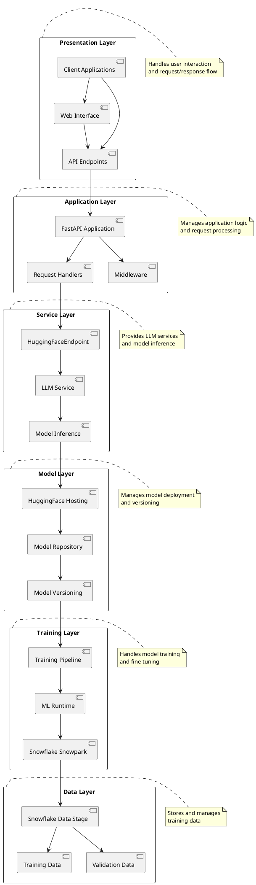

# CareConnect Layered Architecture

## Layer Descriptions

### Presentation Layer
- **Client Applications**: End-user applications that interact with the system
- **Web Interface**: Web-based user interface
- **API Endpoints**: RESTful API endpoints for client communication

### Application Layer
- **FastAPI Application**: Main application server
- **Request Handlers**: Handles incoming requests
- **Middleware**: Cross-cutting concerns like CORS, logging, etc.

### Service Layer
- **HuggingFaceEndpoint**: Interface to HuggingFace services
- **LLM Service**: Language model service implementation
- **Model Inference**: Handles model inference requests

### Model Layer
- **HuggingFace Hosting**: Model hosting service
- **Model Repository**: Model storage and management
- **Model Versioning**: Version control for models

### Training Layer
- **Snowflake Snowpark**: Training infrastructure
- **ML Runtime**: Machine learning runtime environment
- **Training Pipeline**: Model training workflow

### Data Layer
- **Snowflake Data Stage**: Data storage in Snowflake
- **Training Data**: Training dataset management
- **Validation Data**: Validation dataset management 