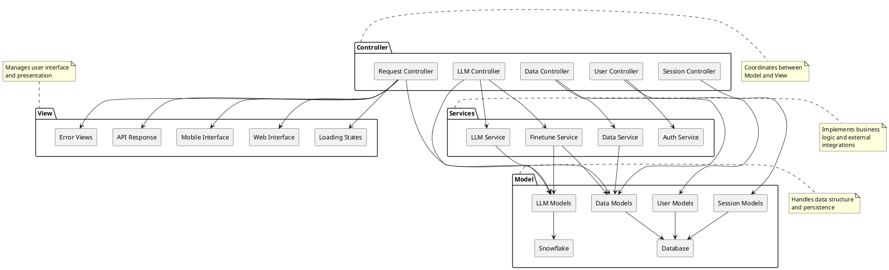

# CareConnect MVC Architecture

## MVC Architecture Description

### Model Layer
- **Data Models**: Core data structures and business objects
- **LLM Models**: Language model configurations and states
- **User Models**: User-related data structures
- **Session Models**: Session management and state
- **Database**: Persistent storage for application data
- **Snowflake**: Data warehouse for model training and analytics

### View Layer
- **Web Interface**: Browser-based user interface
- **Mobile Interface**: Mobile application interface
- **API Response**: Structured API responses
- **Error Views**: Error handling and display
- **Loading States**: Loading and progress indicators

### Controller Layer
- **Request Controller**: Handles incoming requests and routing
- **LLM Controller**: Manages LLM interactions and responses
- **User Controller**: Handles user-related operations
- **Session Controller**: Manages user sessions
- **Data Controller**: Handles data operations

### Service Layer
- **LLM Service**: Manages LLM operations and inference
- **Auth Service**: Handles authentication and authorization
- **Data Service**: Manages data operations and transformations
- **Finetune Service**: Handles model finetuning operations

## Key Features

1. **Separation of Concerns**
   - Clear separation between data, presentation, and control
   - Modular architecture for easy maintenance
   - Independent component development

2. **Data Management**
   - Centralized data models
   - Multiple data sources (Database, Snowflake)
   - Consistent data access patterns

3. **User Interface**
   - Multiple interface options (Web, Mobile, API)
   - Consistent error handling
   - Responsive design patterns

4. **Service Integration**
   - Business logic encapsulation
   - External service integration
   - Reusable service components 