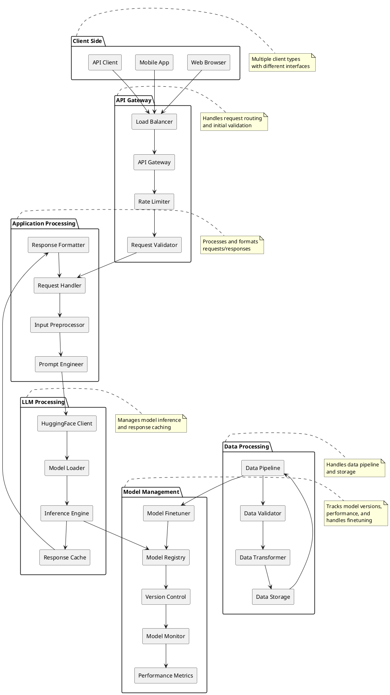

# CareConnect Processing Architecture

## Processing Architecture Description

### Client Side
- **Web Browser**: Web-based interface for users
- **Mobile App**: Mobile application interface
- **API Client**: Programmatic access to the system

### API Gateway
- **Load Balancer**: Distributes incoming requests
- **API Gateway**: Routes requests to appropriate services
- **Rate Limiter**: Prevents API abuse
- **Request Validator**: Validates incoming requests

### Application Processing
- **Request Handler**: Manages incoming requests
- **Input Preprocessor**: Prepares input for the model
- **Prompt Engineer**: Formats prompts for optimal responses
- **Response Formatter**: Formats model outputs

### LLM Processing
- **HuggingFace Client**: Interfaces with HuggingFace services
- **Model Loader**: Loads and manages model instances
- **Inference Engine**: Executes model inference
- **Response Cache**: Caches common responses

### Model Management
- **Model Registry**: Tracks deployed models
- **Version Control**: Manages model versions
- **Model Monitor**: Monitors model performance
- **Performance Metrics**: Tracks model metrics
- **Model Finetuner**: Handles model finetuning using Snowflake Snowpark container services

### Data Processing
- **Data Pipeline**: Manages data flow
- **Data Validator**: Validates data quality
- **Data Transformer**: Transforms data formats
- **Data Storage**: Stores processed data

## Key Features

1. **Scalable Processing**
   - Load balancing for high availability
   - Caching for improved performance
   - Rate limiting for resource management

2. **Quality Assurance**
   - Input validation at multiple levels
   - Data quality checks
   - Performance monitoring

3. **Flexible Integration**
   - Multiple client interfaces
   - API-first design
   - Extensible architecture

4. **Model Management**
   - Version control
   - Performance monitoring
   - Easy model updates
   - Finetuning capabilities using Snowflake Snowpark 